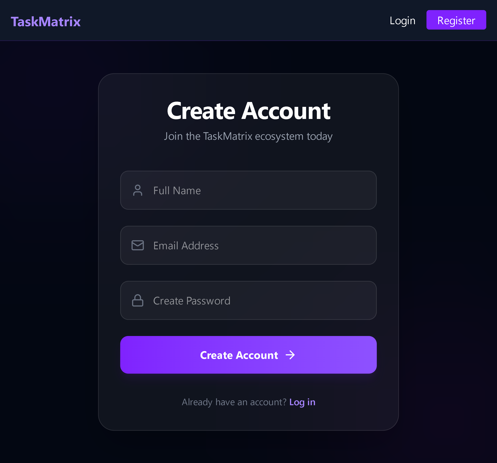
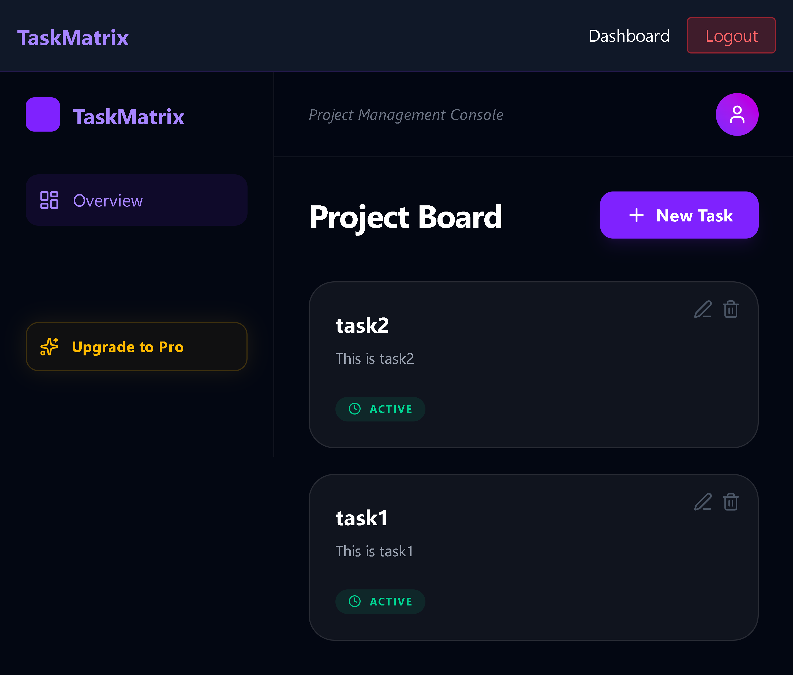

# 🚀 TaskMatrix | Week 15: Feature Complete (CRUD & Monetization)

TaskMatrix is a robust project management tool. **Week 15** marks the transition from a "Walking Skeleton" to a **Feature Complete** application, featuring full CRUD operations and a third-party payment gateway integration.

## 📸 Preview

 
 

## 📺 Project Demo

## 🌌 Core Features (Week 15 Milestones)
- **Full CRUD Operations:** Users can now **Create, Read, Update, and Delete** tasks directly from their dashboard with instant UI feedback.
- **Optimistic UI Updates:** Task deletion and creation happen without full page reloads, providing a snappy, modern feel.
- **Stripe Monetization:** Integrated **Stripe (Test Mode)** for a "Premium" upgrade flow, including a custom Success Page redirect.
- **Data Persistence:** All tasks are securely stored in MongoDB and linked to the specific authenticated user.
- **Advanced UI Components:** Implementation of modals for task editing andLucide-React icons for intuitive navigation.

## 🛠️ Tech Stack Expansion
- **Frontend:** React.js (Vite), Axios, Lucide-React.
- **Backend:** Node.js, Express.js, Stripe SDK.
- **Database:** MongoDB Atlas (Mongoose).
- **Styling:** Tailwind CSS (Glassmorphism & Professional Dark Mode).

## ⚙️ Technical Challenges Solved
1. **Stripe Session Logic:** Successfully engineered the backend to generate dynamic Checkout Sessions and handle secure frontend redirects.
2. **State Syncing:** Solved the "refresh to see changes" issue by manually updating the React state array after successful API calls.
3. **Protected CRUD:** Implemented backend middleware to verify JWT tokens before allowing any Update or Delete operations, ensuring users can only edit their own data.
4. **Modal Logic:** Managed complex form states for the "Edit Task" functionality to pre-fill data accurately.

---
**Developed by [Shivansh Vishwakarma](https://github.com/technoshiva123)** *Full Stack Developer Intern @ Prodesk IT*