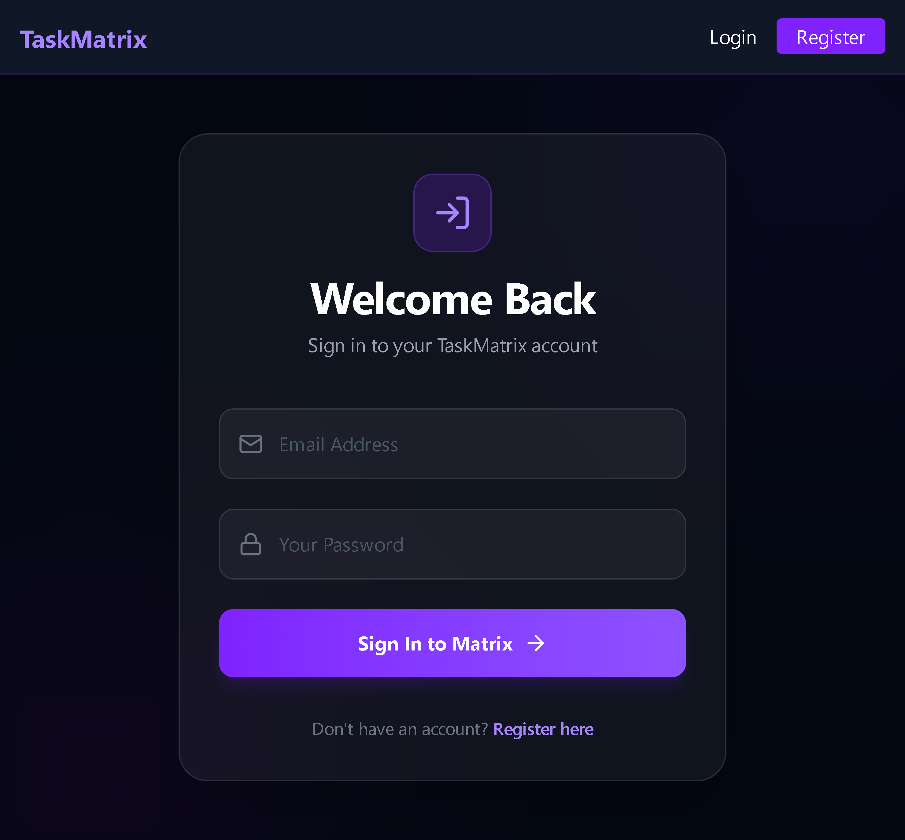
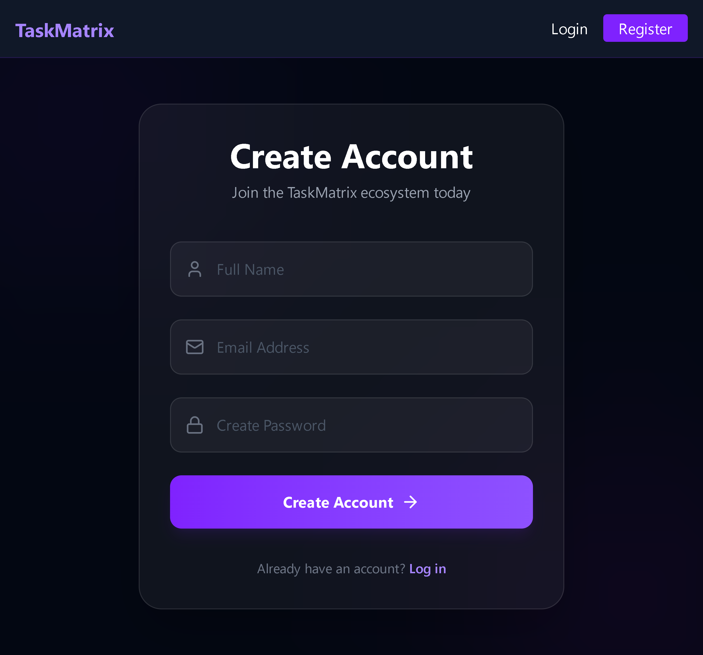
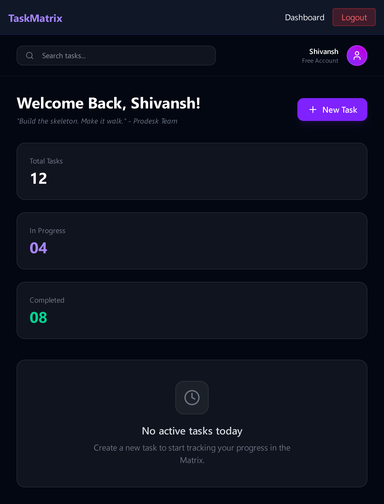

# 🚀 TaskMatrix | Week 14: The Walking Skeleton

TaskMatrix is a full-stack project management tool designed to help software teams organize their workflow efficiently. The primary objective of **Week 14** was to architect a **"Walking Skeleton"** — a minimal end-to-end implementation that connects the frontend, backend, and database into a functional ecosystem.

## 📸 Preview
*Replace these placeholders with your actual screenshot paths once you upload them to your repo.*

## 📺 Project Demo

## 🌌 Core Features (Week 14 Milestones)
- **End-to-End Authentication:** A seamless bridge between the React frontend, Node/Express backend, and MongoDB Atlas.
- **Secure Sessions:** Implementation of **JWT (JSON Web Tokens)** and LocalStorage to manage persistent user login states.
- **Premium Glassmorphism UI:** A modern, high-contrast interface built with **Tailwind CSS**, featuring violet-themed gradients and backdrop-blur effects.
- **Route Protection:** Secure Private Routes that ensure the Dashboard is only accessible to authenticated users.
- **Dynamic User Experience:** Real-time feedback for registration errors and a personalized dashboard greeting (e.g., "Welcome Back, Shivansh!").

## 🛠️ Tech Stack
- **Frontend:** React.js (Vite Architecture).
- **Backend:** Node.js & Express.js.
- **Database:** MongoDB Atlas (Mongoose ODM).
- **Styling:** Tailwind CSS (Custom Glassmorphism configuration).
- **Security:** BcryptJS for password hashing and JWT for session security.

## ⚙️ Technical Challenges Solved
1. **Database Schema Integrity:** Engineered a secure User model in MongoDB to store unique emails and hashed credentials.
2. **Context API Integration:** Developed a global `AuthContext` to synchronize the user's authentication state across the entire application.
3. **Smooth Scroll & Navigation:** Utilized React Router for seamless transitions between the Login, Register, and Dashboard views.
4. **CORS Optimization:** Configured backend middleware to allow secure communication with the frontend running on `localhost:5173`.

---
**Developed by [Shivansh Vishwakarma](https://github.com/technoshiva123/Prodesk-IT-Week-14.git)** *Full Stack Developer Intern @ Prodesk IT*